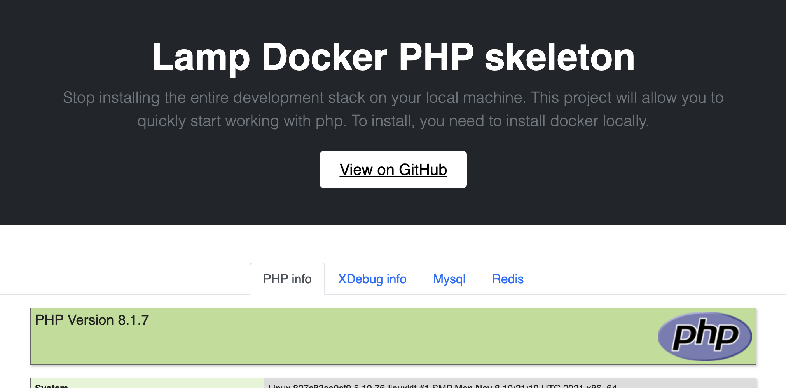

# Lamp Docker skeleton PHP + Nginx + Mysql + Redis
    

Stop installing the entire development stack on your local machine. This project will allow you to quickly start working with php.
To install, you need to install docker locally.

### Features
- Simple and clear project structure;
- Php the latest version 8.1 (can be changed if you need);
- All necessary php extensions including composer and xDebug3;
- Output all necessary logs (nginx, php, mysql, redis, supervisor), including slow mysql queries;
- Supervisor support
- Quick, easy setup for everything you need
- Lots of useful examples

### What's inside

* [Nginx](http://nginx.org/)
* [MySQL](http://www.mysql.com/)
* [PHP-FPM](http://php-fpm.org/)
* [Redis](http://redis.io/)
* [Redis commander](https://joeferner.github.io/redis-commander/)
* [Supervisord](http://supervisord.org/)

### Requirements

* [Docker Engine](https://docs.docker.com/installation/)
* [Docker Compose](https://docs.docker.com/compose/)
* [Docker Machine](https://docs.docker.com/machine/) (Mac and Windows only)

### Before start work

To run the docker commands without using **sudo** you must add the **docker** group to **your-user**:

```bash
sudo usermod -aG docker your-user
```

For now, this project has been mainly created for Unix `(Linux/MacOS)`. Perhaps it could work on Windows.

### MacOS/Linux
```bash
curl -L https://raw.githubusercontent.com/krepysh-spec/lamp-docker-php-skeleton/main/install.sh | bash
# Or if you want it to be installed to a different path:
curl -L https://raw.githubusercontent.com/krepysh-spec/lamp-docker-php-skeleton/main/install.sh | bash -s mypath/
```

### Manually

Clone current project:
```bash
git clone https://github.com/krepysh-spec/lamp-docker-php-skeleton.git && cd lamp-docker-php-skeleton
````

Create .env file from .env_example:
```bash
cp .env_example .env
````
or
```bash
make init
````

### How start work

Fill configuration in .env file

Run bottom command for install application
```bash
make install
```

If you not change ***NGINX_HOST*** and ***NGINX_PORT*** in ***.env*** open in browser [localhost](http://127.0.0.1/)

And you should see something like:


### Makefile
This file helps to quickly interact with the work of docker and additional features.
Read about available commands `make help`

```
Commands:
  init                                     Init skeleton settings
  help                                     List of all commands in make file
  install                                  Install application
  add-host                                 Add nginx host to /etc/hosts file
  bash                                     Exec backend container
  build                                    Build docker-compose
  build-no-cache                           Build docker-compose without cache
  up                                       Up with demon docker containers
  down                                     Down docker containers
  stop                                     Stop docker containers
  clear-all-logs                           Clear all logs in folder /logs
  clear-logs-in folder=[FOLDER]            Clear logs in folder
  watch-log logFilePath=[PATH TO LOG FILE] Watch log file
```

### Project tree

```
.
├── docker - [Docker settings]
│   ├── backend
│   │   ├── Dockerfile
│   │   ├── php
│   │   │   └── conf.d
│   │   │       ├── php.ini
│   │   │       └── xdebug.ini
│   │   └── supervisor
│   │       ├── conf.d
│   │       │   └── example.conf
│   │       └── supervisord.conf
│   ├── mysql
│   │   └── conf.d
│   │       └── my.cnf
│   └── nginx
│       └── nginx.conf
├── docker-compose.yml
├── logs - [All necessary logs are written here]
└── src - [Your workspace]
```

### Project links (Default: http://127.0.0.1/)
- [Homepage](http://127.0.0.1/)
- [Rediscommander](http://127.0.0.1:8081)
- [Supervisor GUI](http://127.0.0.1:9001)

### More documentation
You can also read more information about the project

| Doc                        | README                                     |
|----------------------------|--------------------------------------------|
| xDebug configuration       | [docs/xdebug.md](docs/xdebug.md)           |
| Code sniffer configuration | [docs/codesniffer.md](docs/codesniffer.md) |

### Support

For support, email evgeniymykhalichenko@gmail.com or telegram @krep1sh

### License

MIT