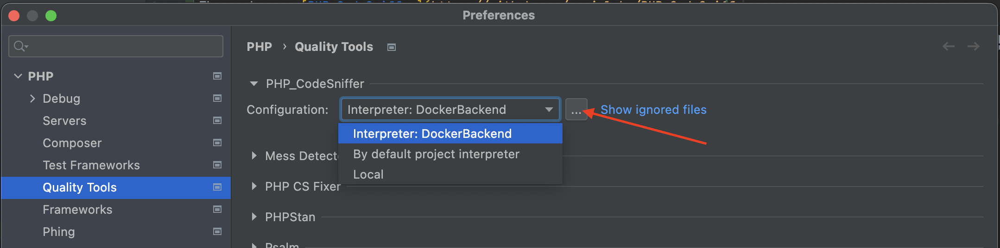
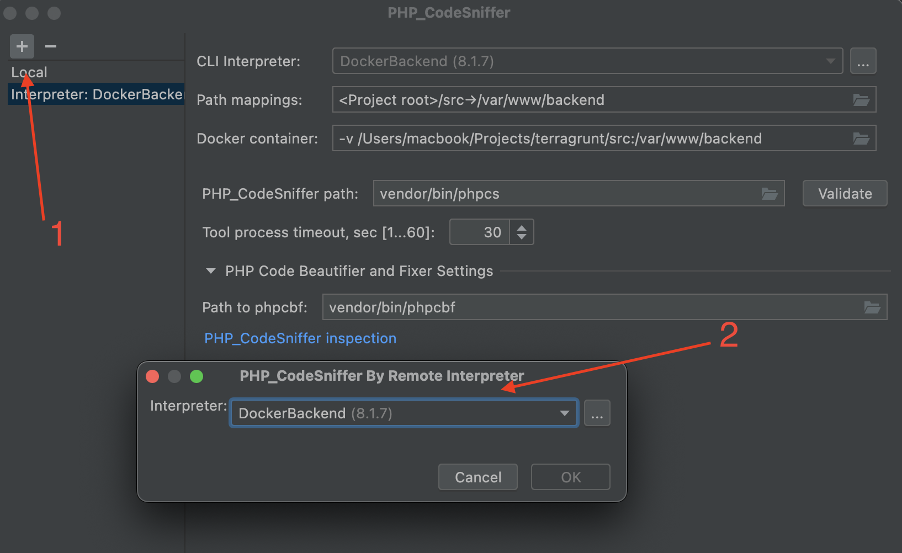
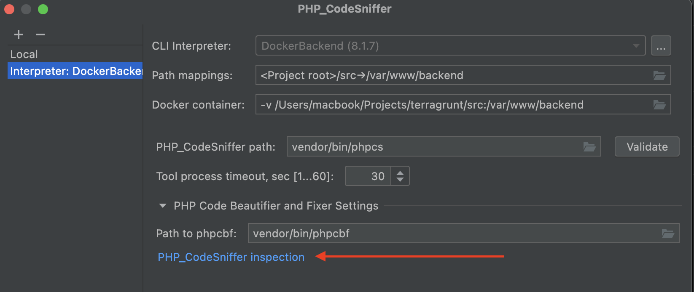
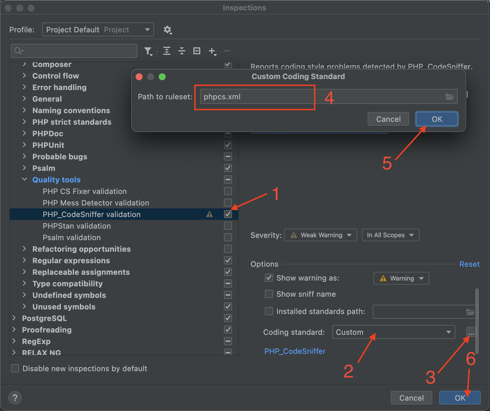
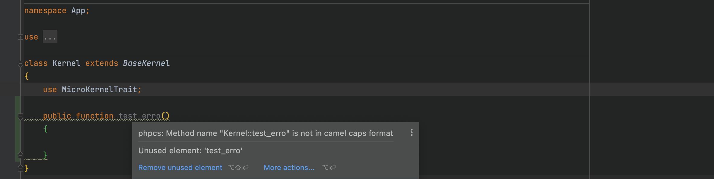

# Setup PHP_CodeSniffer in phpStorm
The package - [PHP_CodeSniffer](https://github.com/squizlabs/PHP_CodeSniffer)

CodeSniffer load coding standards from file ***phpcs.xml*** 

- In the ***Settings/Preferences***, navigate to ***PHP | Quality Tools***.
- On the Quality Tools page that opens, expand the PHP_CodeSniffer area and click the Browse button next to the Configuration list.
- In the PHP_CodeSniffer dialog that opens, empty the PHP_CodeSniffer path field.
  
  
  
  
- Result
  

