# Setup xDebug in phpStorm

### Let's debugging
- Here we want to configure our PHP docker interpreter. a. Go to ***Preferences > PHP***, add new interpreter, select new interpreter from Docker, vagrant, etc...
  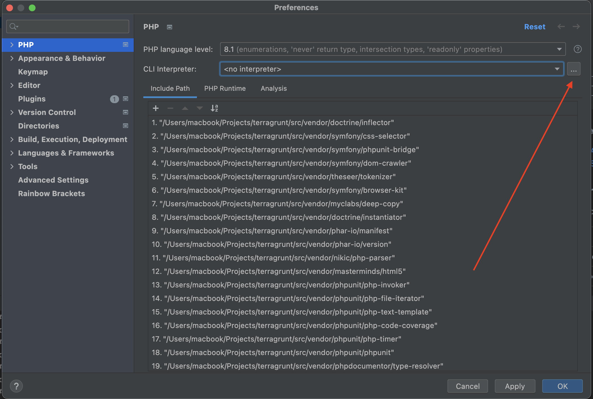
  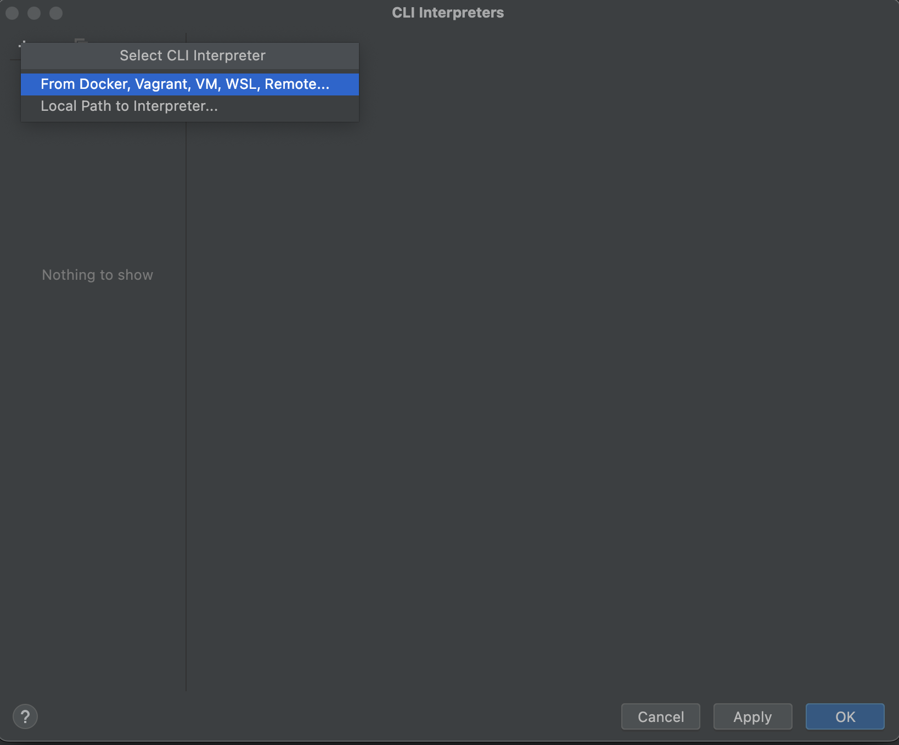

- Create new Server.
  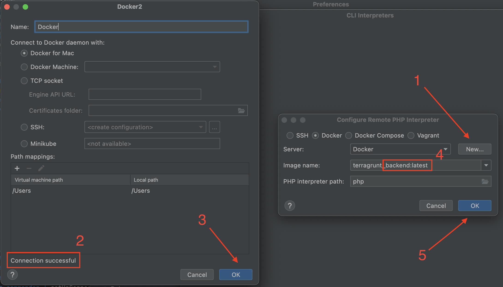
  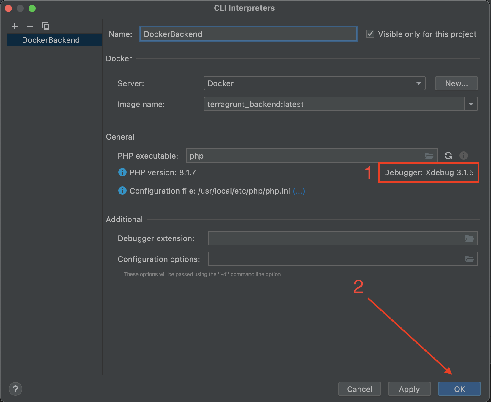

- After selecting an Interpreter, we are going to map our working project with container path,
  my working project path is $HOME/Projects/terragrunt
  docker and I will map into ***.env > DOCKER_WORK_DIR***,
  so change the Docker container value:
  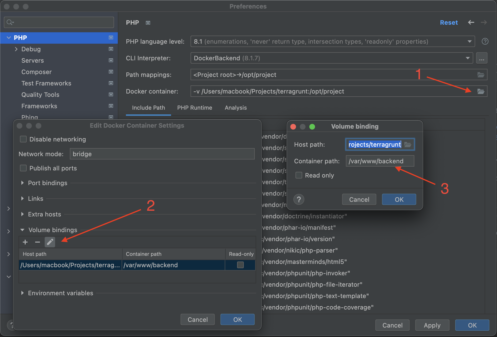

- This the result :
  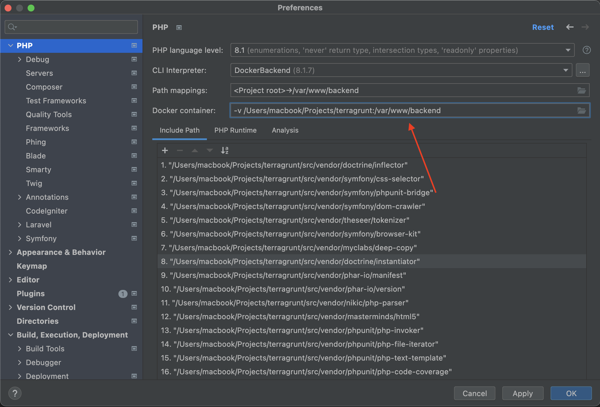

### Xdebug configuration.
- Go to ***Preferences > PHP > Debug***, set like this:
  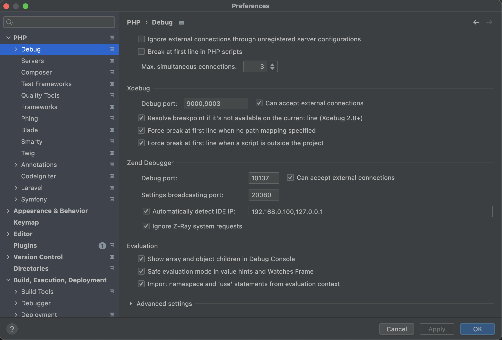 
- Go to ***Preferences > PHP > Debug > Dbgp Proxy***, set like this (note: IDE Key must same with the value of xdebug.idekey on php.ini):
  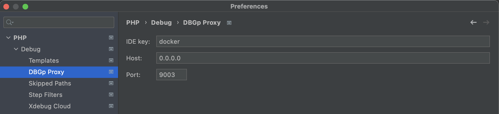
- Go to ***Run > Edit Configurations...***, create a new PHP Remote Debug configuration:
  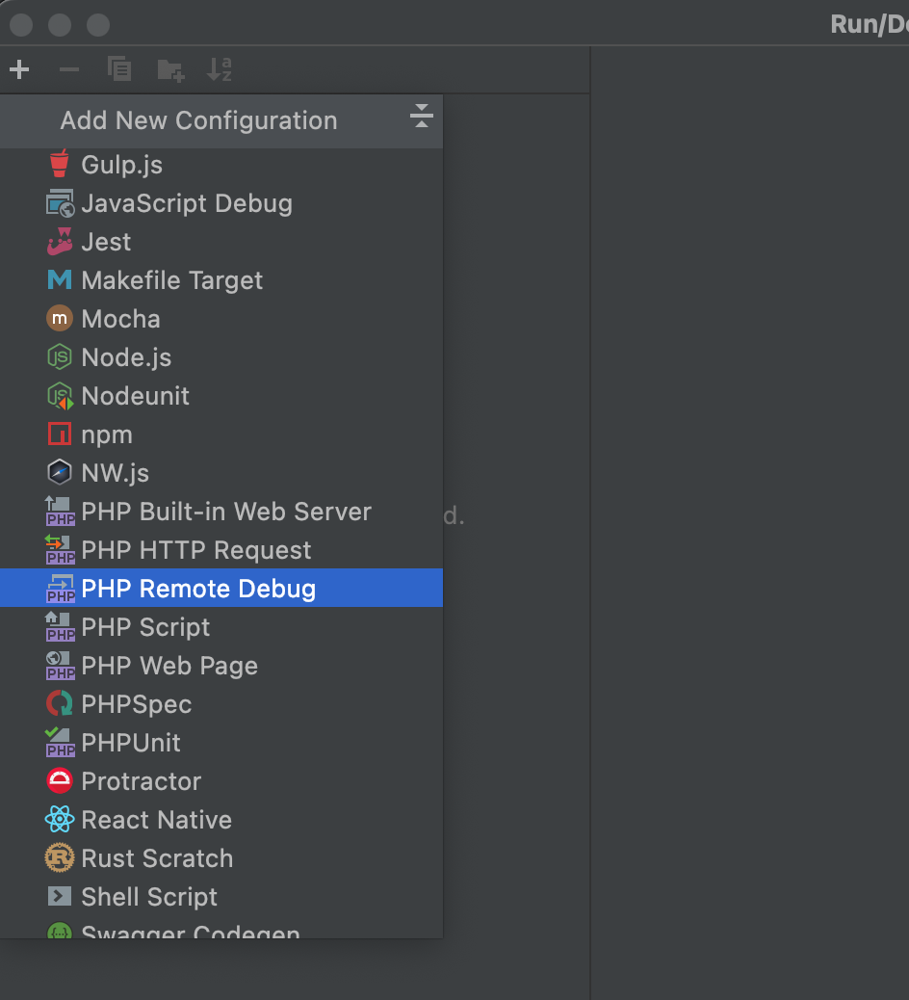
  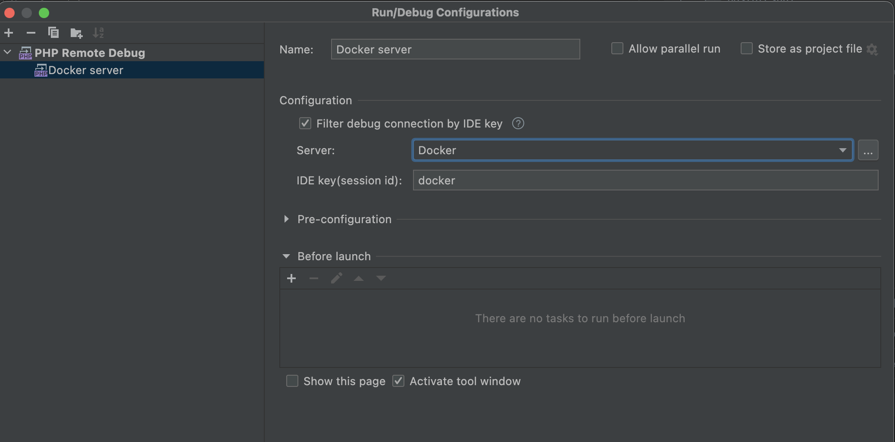
- Go to ***Run > Web Server Debug Validation***, on Path to create validation script I point the value into my public path of project, and URL to validation script I point to my nginx docker host.
  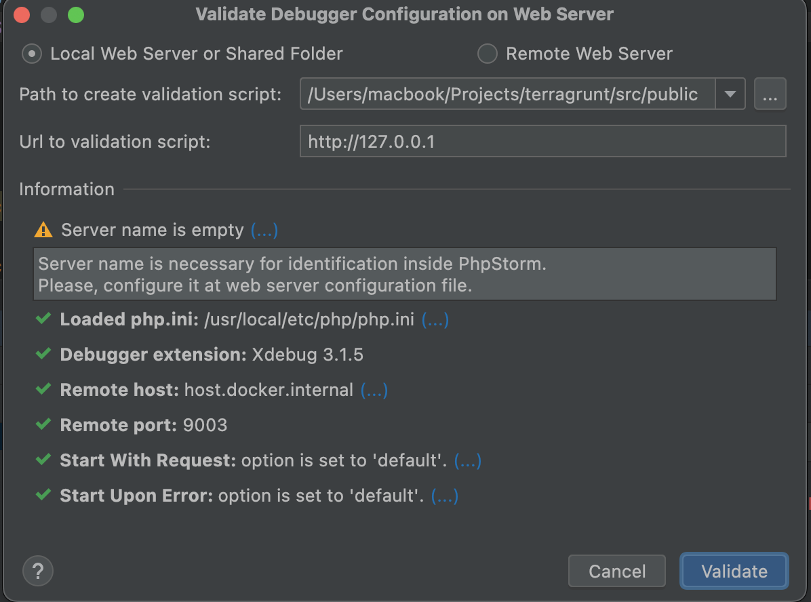
  
### EXECUTE!
- Set breakpoint, and turning on Start Listening for PHP Debug Connection
  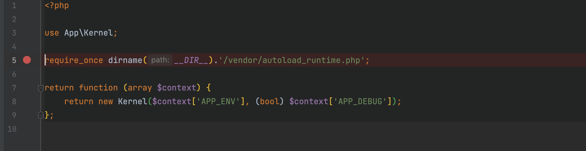
  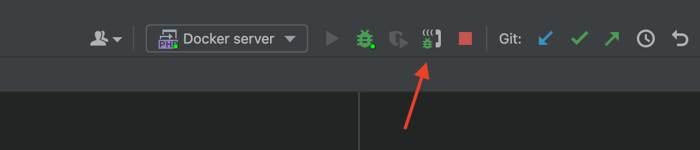
- Go to ***Run > Debug*** then select the configuration what we made earlier (PHP Remote Debug):
  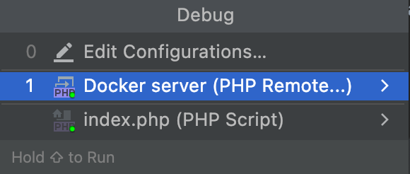
- Go to your endpoint, and add query string with parameter ***XDEBUG_SESSION_START*** and the value is your IDE Key, then execute!
  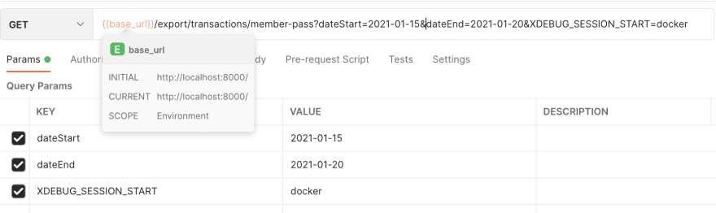
- Or if you need debugging in browser use this extension - [Xdebug helper](https://chrome.google.com/webstore/detail/xdebug-helper/eadndfjplgieldjbigjakmdgkmoaaaoc)
    

  